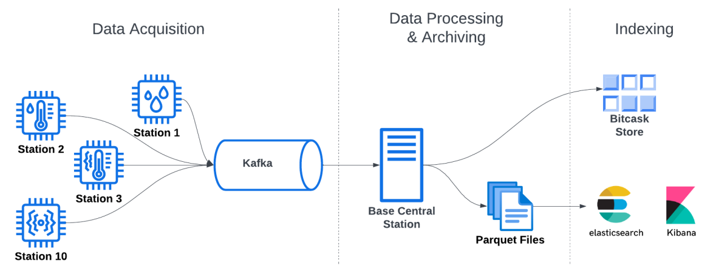

#  Weather Stations Monitoring System 




A distributed streaming pipeline that ingests and archives IoT data from simulated weather stations using Kafka, a custom BitCask storage engine, Parquet, and Elasticsearch. 

---

##  Architecture Overview 

The system is divided into three core stages: 

```text
┌─────────────────────────────────────────────────────┐
│ 1. DATA ACQUISITION (IoT Edge)                      │
│ WeatherStation x10 + OpenMeteo Adapter              │
│ → serialize to JSON → push to Kafka                 │
└─────────────────────┬───────────────────────────────┘
                      ↓
┌─────────────────────────────────────────────────────┐
│ 2. PROCESSING & STORAGE (Central Station)           │
│ Kafka Consumer                                      │
│ ├── BitCask (O(1) latest-state lookups)             │
│ └── Parquet (long-term columnar archive)            │
└─────────────────────┬───────────────────────────────┘
                      ↓
┌─────────────────────────────────────────────────────┐
│ 3. ANALYTICS INDEXING                               │
│ Elasticsearch ← Kibana dashboards                   │
└─────────────────────────────────────────────────────┘

```

---

##  Technical Implementation

### 1. Custom BitCask Engine

Built to handle the write-heavy IoT workload efficiently:

* **Lock-Free Concurrent Reads:** Open `FileChannel` instances are cached using Java NIO. Absolute-position reads (`FileChannel.read(ByteBuffer, position)`) allow multiple API threads to read concurrently without blocking the writer.
* **Compaction & Crash Recovery:** Background daemon threads run periodic compaction and generate lightweight `.hint` files (keys + offsets only). On restart, the engine uses these hint files to reconstruct the in-memory `KeyDir` hashmap, bypassing full file parsing.
* **Segment Rotation:** Append-only writes with configurable segment rotation (`active_segment.data`) prevent unbounded file growth.

### 2. Parquet Archiver

Translates unstructured JSON streams into columnar blocks:

* **Avro Schema:** Dynamically loads `weather_status.avsc` to enforce data types before writing via `AvroParquetWriter`.
* **Dual-Flush Strategy:** Records buffered in a `ConcurrentHashMap`, flushed when a partition hits 1000 records or every 20 minutes via a background sweeper thread.
* **Config:** Bound to Java’s `LocalFileSystem` (no HDFS), SNAPPY compression, 64KB page size optimized for small batch sizes.

### 3. Kafka Streams — Rain Detection

* Filters messages where humidity > 70% using the Kafka Streams API.
* Maps to a `RainAlert` object and publishes to `rain-alerts-topic`.
* Uses `CountDownLatch` + JVM Shutdown Hooks for safe container termination.

### 4. OpenMeteo Channel Adapter

Polls the Open-Meteo API every second for four real-world locations — Cairo, Alexandria, London, New York — and publishes to the same `weather-data` Kafka topic as hardware stations. Negative station IDs (-1 to -4) distinguish API-sourced data from hardware stations with no schema changes.

---

##  Enterprise Integration Patterns (EIP)

| Pattern | Implementation |
| --- | --- |
| **Message Channel** | Kafka topics (`weather-data`, `rain-alerts`) |
| **Channel Adapter** | OpenMeteoAdapter — bridges Open-Meteo REST API → Kafka |
| **Polling Consumer** | CentralStation polls Kafka every 1s |
| **Event-Driven Consumer** | RainDetectionProcessor reacts to messages automatically |
| **Content-Based Router** | Rain filter routes humidity > 70% to alert topic |
| **Dead Letter Channel** | Dropped messages tracked via `s_no` sequence gaps, indexed in Elasticsearch |

---

##  Kubernetes Deployment

### Prerequisites

* Docker
* Minikube
* kubectl

### Deploy

```bash
# 1. Start Minikube
minikube start

# 2. Point Docker to Minikube's registry
eval $(minikube docker-env)

# 3. Build images
docker build -t station:latest ./station
docker build -t central-station:latest ./central-station
docker build -t adapter:latest ./adapter

# 4. Apply config
kubectl apply -f k8s.yaml

# 5. Watch pods come up
kubectl get pods -w

```

### Access Kibana

```bash
kubectl port-forward service/kibana 5601:5601
# Open http://localhost:5601 in your browser

```

